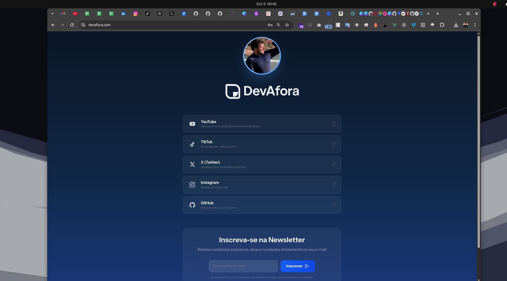
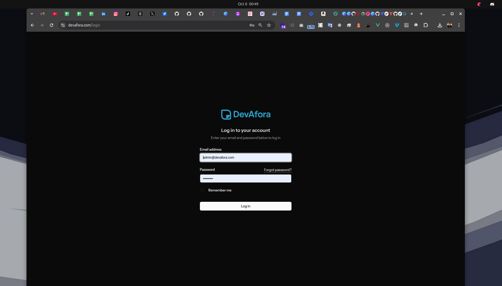
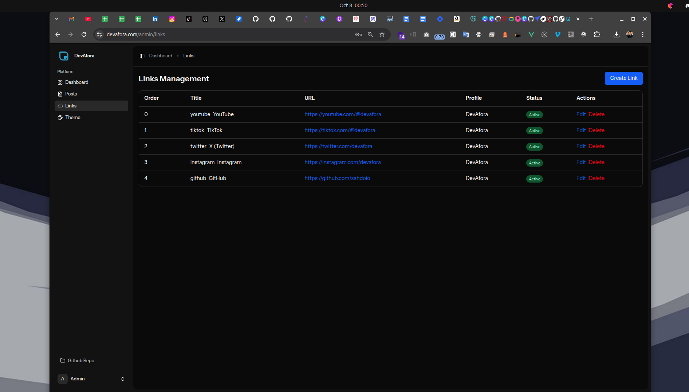

# DevAfora

> A modern, customizable link-in-bio platform built with Laravel 11, Vue 3, and Inertia.js

Transform your social media presence with a sleek, dark-themed platform that combines link aggregation, blogging, and newsletter management - all in one place.


## ✨ Features

- **🔗 Smart Link Management** - Organize and showcase your important links with custom icons and descriptions
- **📝 Integrated Blog System** - Share long-form content with markdown support, syntax highlighting, and live preview
- **💌 Newsletter Platform** - Build your audience with built-in email subscription management via Postmark
- **🎨 Theme Customization** - Personalize your brand with a complete color management system
- **🌙 Dark Mode First** - Beautiful, modern dark interface designed for readability
- **🔒 Secured Admin Panel** - Registration disabled by default - invite-only access
- **⚡ Lightning Fast** - Built with Vite for instant hot reload and optimized production builds
- **📱 Fully Responsive** - Perfect experience across all devices







## 🚀 Quick Start

```bash
# Clone the repository
git clone https://github.com/sahdoio/devafora.git
cd devafora

# Install dependencies
composer install
npm install

# Setup environment
cp .env.example .env
php artisan key:generate
touch database/database.sqlite

# Migrate and seed
php artisan migrate --seed

# Start development
php artisan serve & npm run dev
```

Visit http://localhost:8000 and start customizing!

## 🛠️ Tech Stack

**Backend:**
- Laravel 11 - Modern PHP framework
- SQLite - Lightweight database
- Fortify - Authentication & security
- Postmark - Transactional emails

**Frontend:**
- Vue 3 + TypeScript - Type-safe reactive UI
- Inertia.js - SPA without the API complexity
- Tailwind CSS 4 - Utility-first styling
- Vite - Next-gen build tool
- Marked.js - Markdown parsing
- Highlight.js - Code syntax highlighting

## 📋 Requirements

- PHP 8.2+
- Composer
- Node.js 18+
- SQLite3

## 🏗️ Architecture

DevAfora follows a clean, action-based architecture that separates concerns and keeps code maintainable.

### Action Pattern

Business logic lives in dedicated Action classes with a single `execute()` method:

```
app/Actions/
├── Newsletter/
│   ├── SubscribeToNewsletterAction.php
│   └── SendWelcomeEmailAction.php
├── Post/
│   ├── CreatePostAction.php
│   └── PublishPostAction.php
└── Link/
    └── ReorderLinksAction.php
```

### Thin Controllers

Controllers are lightweight - they inject Actions and return responses:

```php
public function subscribe(
    SubscribeNewsletterRequest $request,
    SubscribeToNewsletterAction $action
) {
    $subscription = $action->execute($request->validated());
    return response()->json(['message' => 'Subscribed!']);
}
```

### Resources Layer

All API responses go through Laravel Resources for consistent data transformation:

```
app/Http/Resources/
├── PostResource.php
├── PostListResource.php
├── LinkResource.php
└── ProfileResource.php
```

### Domain-Driven Models

Models contain domain logic using DDD principles:

```php
class Post extends Model
{
    public function publish(): void
    public function generateSlug(): void
    public function scopePublished(Builder $query): Builder
}
```

## 📂 Project Structure

```
devafora/
├── app/
│   ├── Actions/           # Business logic
│   ├── Http/
│   │   ├── Controllers/   # Thin controllers
│   │   ├── Resources/     # API transformers
│   │   └── Requests/      # Form validation
│   └── Models/            # Eloquent models
├── resources/
│   ├── js/
│   │   ├── components/    # Vue components
│   │   ├── pages/         # Inertia pages
│   │   └── layouts/       # Layout components
│   └── css/               # Tailwind styles
├── database/
│   ├── migrations/        # Schema definitions
│   ├── factories/         # Test data factories
│   └── seeders/           # Database seeders
└── tests/                 # Feature & unit tests
```

## 🗄️ Database Schema

### Core Tables

**profiles** - User profiles with bio, photo, and social links
**links** - Ordered social media links with icons and descriptions
**posts** - Blog posts with markdown content, tags, and featured images
**newsletter_subscriptions** - Email subscribers with status tracking
**settings** - Dynamic app configuration (colors, theme, etc.)

## 🎨 Customization

### Theme Colors

Access `/admin/settings/theme` to customize your brand colors:

- Primary, Secondary, and Accent colors
- Background colors for cards and sections
- Text colors for different contexts
- Border colors

All changes are applied instantly across the entire application!

### Profile Setup

Edit your profile in `database/seeders/ProfileSeeder.php`:

```php
Profile::create([
    'name' => 'Your Name',
    'bio' => 'Your bio here...',
    'photo' => '/images/profile.jpeg',
]);
```

### Adding Links

Customize your links in `database/seeders/LinkSeeder.php`:

```php
Link::create([
    'profile_id' => 1,
    'title' => 'GitHub',
    'url' => 'https://github.com/yourname',
    'icon' => '🐙',
    'order' => 1,
]);
```

## 📧 Email Configuration

### Postmark Setup

1. Sign up at [Postmark](https://postmarkapp.com)
2. Get your API token
3. Add to `.env`:

```env
MAIL_MAILER=postmark
POSTMARK_TOKEN=your-token-here
MAIL_FROM_ADDRESS=hello@yourdomain.com
MAIL_FROM_NAME="${APP_NAME}"
```

### Development Testing

Use Mailtrap for testing emails in development:

```env
MAIL_MAILER=mailtrap
MAILTRAP_HOST=sandbox.smtp.mailtrap.io
MAILTRAP_PORT=2525
MAILTRAP_USERNAME=your-username
MAILTRAP_PASSWORD=your-password
```

## 🚀 Deployment

### Laravel Cloud (ARM64)

This project is optimized for Laravel Cloud with ARM64 support:

```json
{
  "optionalDependencies": {
    "@rollup/rollup-linux-arm64-gnu": "4.9.5",
    "@tailwindcss/oxide-linux-arm64-gnu": "^4.0.1",
    "lightningcss-linux-arm64-gnu": "^1.29.1"
  }
}
```

### Production Build

```bash
# Build assets
npm run build

# Optimize Laravel
php artisan optimize
php artisan config:cache
php artisan route:cache
php artisan view:cache

# Run migrations
php artisan migrate --force
```

## 🧪 Testing

```bash
# Run all tests
php artisan test

# Run specific test suite
php artisan test --filter=Auth

# Run with coverage
php artisan test --coverage
```

**Test Results:** 39 passed, 1 skipped (registration disabled)

## 🔐 Security

- Registration disabled by default (invite-only admin)
- Two-factor authentication support via Fortify
- Email verification required
- Password confirmation for sensitive operations
- Rate limiting on authentication endpoints
- CSRF protection on all forms

## 📝 Available Routes

### Public Routes
```
GET  /                     # Homepage with links and posts
GET  /posts/{slug}         # Individual blog post
POST /api/newsletter/subscribe  # Newsletter subscription
```

### Admin Routes (Auth Required)
```
GET  /admin/dashboard      # Admin dashboard
GET  /admin/posts          # Manage posts
GET  /admin/links          # Manage links
GET  /admin/settings/theme # Theme customization
```

## 🤝 Contributing

Contributions are welcome! Please feel free to submit a Pull Request.

1. Fork the repository
2. Create your feature branch (`git checkout -b feature/AmazingFeature`)
3. Commit your changes (`git commit -m 'Add some AmazingFeature'`)
4. Push to the branch (`git push origin feature/AmazingFeature`)
5. Open a Pull Request

## 📄 License

This project is open-sourced software licensed under the [MIT license](LICENSE).

## 🙏 Acknowledgments

- Built with [Laravel](https://laravel.com)
- Powered by [Vue.js](https://vuejs.org)
- Styled with [Tailwind CSS](https://tailwindcss.com)
- Icons from [Lucide](https://lucide.dev)

---

**Made with ❤️ by [DevAfora](https://github.com/sahdoio/devafora)**
