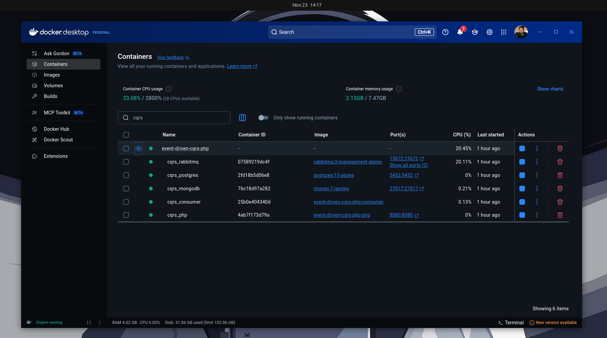
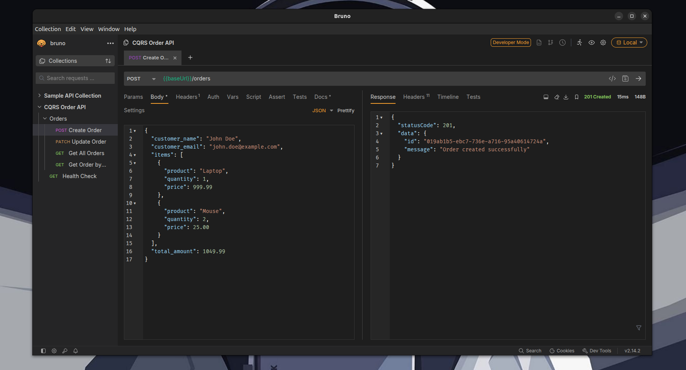
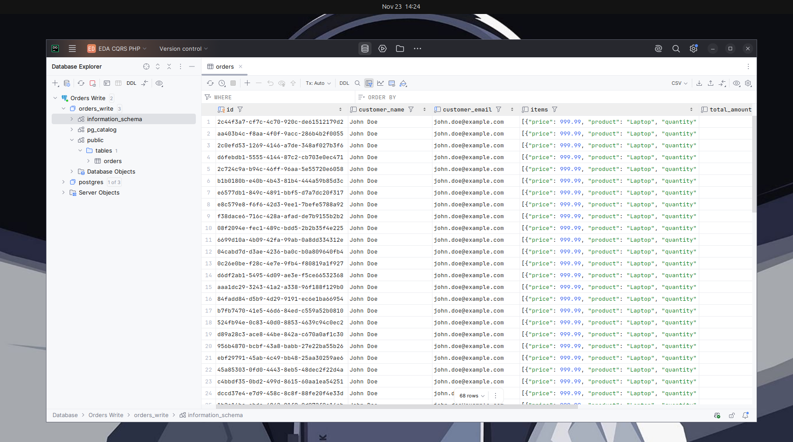
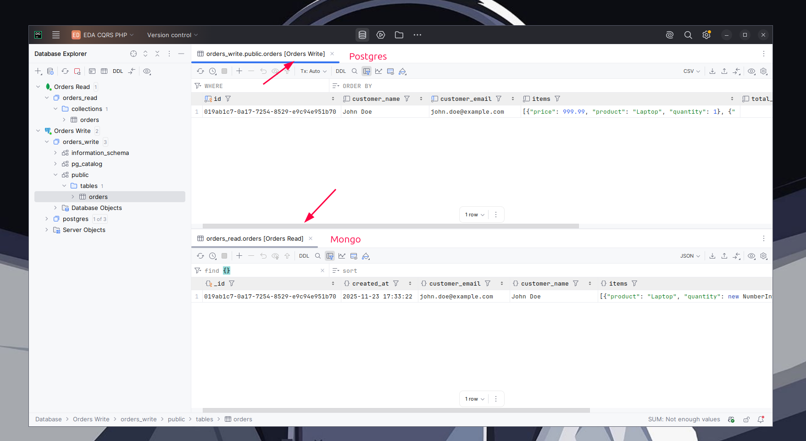
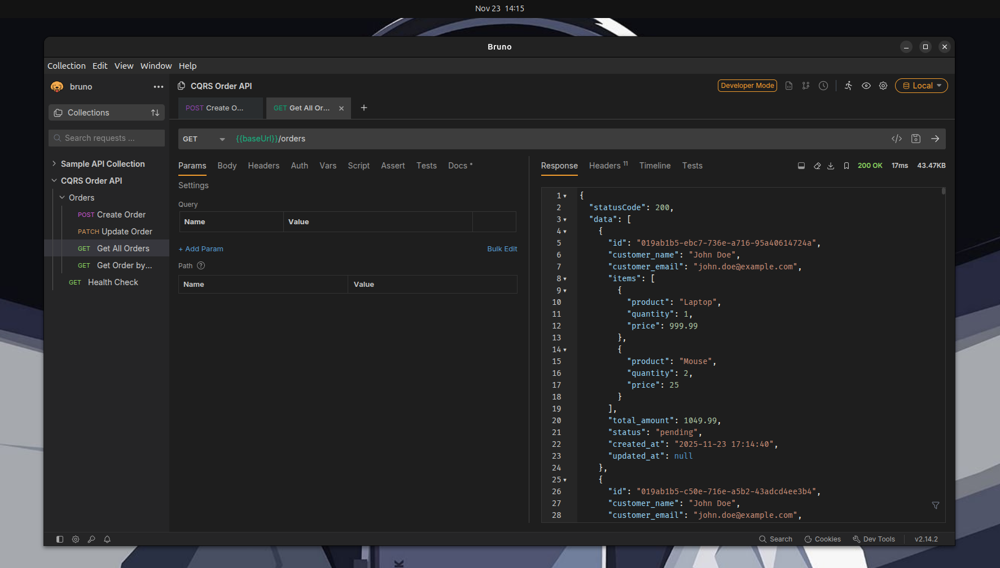

As software engineers, we've all been there: building yet another CRUD application with a single database, where read and write operations compete for resources, complex queries slow down as data grows, and scaling becomes a nightmare. For years, this monolithic approach worked well enough for most applications. But what happens when your system needs to handle thousands of concurrent reads while processing critical writes? What if you need different data structures for displaying information versus storing it?

Enter **CQRS** (Command Query Responsibility Segregation) and **Event-Driven Architecture** – patterns that challenge the traditional way we build applications by answering a simple but important question: ***Why should reading data work the same way as writing it?***

In this article, I'll walk you through building an example of a simple Order Management System that implements CQRS with PHP 8.4, using Slim Framework, RabbitMQ, PostgreSQL, and MongoDB. But more importantly, I'll explain *why* you might want to use these patterns, *when* they make sense, and *how* to implement them without overcomplicating your architecture.

## What We'll Build

We'll create a system where:

- **Write operations** (creating/updating orders) go to PostgreSQL
- **Read operations** (querying orders) come from MongoDB
- **Events** connect both sides through RabbitMQ
- Everything is containerized with Docker for easy setup

By the end, you'll understand not just how CQRS works in theory, but how to implement it in PHP.

## Why This Matters

Traditional CRUD applications face real challenges:

- Read queries can block write operations
- Complex joins slow down as data grows
- Scaling reads and writes independently is difficult
- One database structure must serve all purposes

CQRS solves these problems by recognizing a fundamental truth: **the way we write data is rarely the optimal way to read it.**

## What is CQRS, Really?

CQRS stands for **Command Query Responsibility Segregation**. The idea is simple: separate the code that changes data from the code that reads data.

In typical applications, everything hits the same database. One database handles everything with one structure that tries to be good at both reading and writing. Usually it ends up mediocre at both.

CQRS **splits this responsibility**. Write operations use one model and read operations use another model. They can share the same database or use different ones. In our project, we take it further by using PostgreSQL for writes and MongoDB for reads, with RabbitMQ keeping them in sync. When something changes on the write side, an event gets sent through the message queue. A consumer picks it up and updates the read side.

The key point is that CQRS is about separating the models and responsibilities, not necessarily about having two databases. You could have CQRS with a single database using different tables or even different queries against the same tables. The dual-database approach with message queues is just one way to implement it.

This makes sense when your reads vastly outnumber your writes. An e-commerce site might have ten thousand people browsing but only fifty making purchases. It also helps when read and write operations need different things. Writing needs data integrity and transactions. Reading needs speed and denormalized data.

**Skip CQRS for simple CRUD apps, admin panels, or internal tools**. If your database isn't slow and your reads and writes are roughly equal, **you're just adding complexity for no reason**.

Event-driven architecture pairs well with CQRS but isn't required. You could implement CQRS by directly updating both models synchronously. In our project, we use events because they provide flexibility. When a user creates an order, you handle the write and create an event. That event goes to RabbitMQ. Multiple listeners can react: one updates MongoDB, another sends an email, another logs analytics. Your write code stays simple. It just says "an order was created" and walks away. Everything else happens in the background.

The trade-off is eventual consistency. Your read database won't update instantly. There's a small delay while the event travels through the message queue. For most applications, a delay of a few milliseconds is fine.

As Greg Young points out in his CQRS documentation, "the command and query sides have very different needs." The command side processes transactions with consistent data and needs strong guarantees. The query side, however, can be eventually consistent in most systems. This difference is actually an advantage: it's far easier to process transactions with consistent data than to handle all the edge cases that eventual consistency brings into play on the write side.

But if you're building something like banking software where data must be immediately consistent, you need to think carefully about this trade-off.

## A Word of Caution

Martin Fowler, one of the most respected voices in software architecture, offers an important warning about CQRS. He notes that "while CQRS can benefit a few complex domains, such suitability is very much the minority case." Usually there's enough overlap between the command and query sides that sharing a model is easier. Using CQRS on a domain that doesn't match it will add complexity, **thus reducing productivity and increasing risk**.

This is worth taking seriously. **CQRS is not a default architecture**. It's a specialized tool for specific problems. Most applications are better served by a traditional architecture where reads and writes share the same model. The complexity you add with CQRS needs to pay for itself with clear benefits: better scalability, clearer separation of concerns, or the ability to optimize reads and writes differently.

Before implementing CQRS, ask yourself: do I actually have these problems? If your application works fine with a single database and traditional queries, stick with that. Simple is better than clever.

## The Project: Order Management System

To understand CQRS in practice, we built an order management system. The application is simple enough to grasp quickly but complete enough to demonstrate all the moving parts.

The system handles basic order operations. You can create orders, update their status, and query them. Nothing fancy. But under the hood, writes go to PostgreSQL while reads come from MongoDB, with RabbitMQ keeping everything in sync.

### Architecture Overview

Here's how the pieces fit together:

```text
+-------------+
|   client    |
+------+------+
       |
       | post /orders
       v
+-----------------+
|   slim api      |
|  (commands)     |
+--------+--------+
         |
         v
+-----------------+
|  postgresql     |
|  (write db)     |
+--------+--------+
         |
         | event: ordercreated
         v
+-----------------+
|   rabbitmq      |
|   (queue)       |
+--------+--------+
         |
         v
+-----------------+
|   consumer      |
|   (listener)    |
+--------+--------+
         |
         v
+-----------------+
|   mongodb       |
|   (read db)     |
+--------+--------+
         |
         | get /orders
         ^
+-----------------+
|   slim api      |
|   (queries)     |
+-----------------+
```

When a client creates an order, the request hits our Slim API. The API executes a command that saves the order to PostgreSQL. At this point, the order exists in the write database, but nowhere else.

Next, the command handler dispatches an event. This event gets published to RabbitMQ, where it sits in a queue waiting to be processed. The API responds to the client immediately without waiting for anything else to happen.

Meanwhile, a separate consumer process runs continuously, listening to the RabbitMQ queue. When it sees the order created event, it pulls the relevant data and writes it to MongoDB in a structure optimized for reading.

Now when a client queries for orders, the API reads directly from MongoDB. No joins, no complex queries. The data is already shaped exactly how we need it.

### The Directory Structure

```text
event-driven-cqrs-php/
│
├── api/
│   ├── src/
│   │   ├── Application/         ← HTTP layer
│   │   │   ├── Actions/         (Request handlers)
│   │   │   ├── Command/         (Write operations)
│   │   │   └── Query/           (Read operations)
│   │   │
│   │   ├── Domain/              ← Business logic
│   │   │   └── Order/
│   │   │       ├── Event/       (Domain events)
│   │   │       └── Order.php    (Entity)
│   │   │
│   │   └── Infrastructure/      ← Technical details
│   │       ├── Consumer/        (RabbitMQ listener)
│   │       ├── Persistence/     (PostgreSQL)
│   │       └── Query/           (MongoDB)
│   │
│   └── bin/
│       └── consumer.php         ← Background worker
│
└── docker/
    ├── php/
    └── postgres/
```

The project follows a clean architecture with three main layers.

The Application layer contains everything related to handling requests. Actions are the HTTP handlers that receive requests and return responses. Commands represent write operations with their handlers. Queries represent read operations with their handlers.

The Domain layer holds the business logic. This is where the Order entity lives, along with domain events like OrderCreated and OrderStatusChanged. The domain doesn't know anything about databases or HTTP. It just models what an order is and what can happen to it.

The Infrastructure layer handles all the technical details. Database connections, repository implementations, event listeners, and the RabbitMQ consumer all live here. This layer is the bridge between your domain and the outside world.

### The Flow in Detail

Let's trace what happens step by step when you create an order:

```text
1. Client Request
   POST /orders
   {
     "customer_name": "John Doe",
     "items": [...]
   }

2. Action Handler
   ↓
   CreateOrderCommand

3. Command Handler
   ↓
   Save to PostgreSQL
   ↓
   Dispatch OrderCreated Event

4. Event Listener
   ↓
   Publish to RabbitMQ
   ↓
   [API responds to client]

5. Consumer (background)
   ↓
   Read from RabbitMQ
   ↓
   Write to MongoDB

6. Query Time
   GET /orders
   ↓
   Read from MongoDB
   ↓
   Return response
```

The request comes in as a POST to `/orders` with JSON data. An Action handler receives it and creates a CreateOrderCommand with the request data. This command gets passed to a CreateOrderCommandHandler.

The command handler does two things. First, it saves the order to PostgreSQL using a repository. Second, it dispatches an OrderCreated event using League Event dispatcher.

An event listener immediately catches this event and publishes a message to RabbitMQ. The message contains the order ID and relevant data. At this point, the API request is done and sends a response back to the client.

The consumer process, which runs separately in its own container, picks up the message from RabbitMQ. It reads the order data and writes it to MongoDB in a denormalized format. Now the read model is updated.

When someone queries for orders, they hit GET `/orders`. A Query handler receives the request and fetches data directly from MongoDB. Fast, simple, no complex queries needed.

### Database Structures

Here's how the same order looks in each database:

**PostgreSQL (Write Model - Normalized):**

```text
orders table:
┌─────────────────────────────────────┬─────────────┬─────────┬────────────┐
│ id                                  │ customer_id │ total   │ status     │
├─────────────────────────────────────┼─────────────┼─────────┼────────────┤
│ 550e8400-e29b-41d4-a716-446655440000│ 123         │ 1049.99 │ pending    │
└─────────────────────────────────────┴─────────────┴─────────┴────────────┘

order_items table:
┌──────────┬────────────────────────────────────┬──────────┬──────────┐
│ order_id │ product_id                         │ quantity │ price    │
├──────────┼────────────────────────────────────┼──────────┼──────────┤
│ 550e...  │ prod_001                           │ 1        │ 999.99   │
│ 550e...  │ prod_002                           │ 2        │ 25.00    │
└──────────┴────────────────────────────────────┴──────────┴──────────┘
```

**MongoDB (Read Model - Denormalized):**

```json
{
  "_id": "550e8400-e29b-41d4-a716-446655440000",
  "customer_name": "John Doe",
  "customer_email": "john@example.com",
  "items": [
    {"product": "Laptop", "quantity": 1, "price": 999.99},
    {"product": "Mouse", "quantity": 2, "price": 25.00}
  ],
  "total_amount": 1049.99,
  "status": "pending",
  "created_at": "2024-01-15T10:30:00Z"
}
```

PostgreSQL keeps things normalized for data integrity. MongoDB has everything pre-joined and ready to display.

### Why This Structure Works

The separation of concerns is clear. Commands never touch MongoDB. Queries never touch PostgreSQL. Events flow in one direction from write to read.

You can scale each piece independently. Need to handle more reads? Add MongoDB replicas. Need to process events faster? Run multiple consumer instances. The write database can stay small and focused.

Testing becomes easier too. You can test command handlers without worrying about the read model. You can test query handlers without setting up event processing. Each piece has one job and does it well.

Let's dive in and see how this works in practice.

## Looking at the Code

Now let's see how this actually works in practice. I'll walk you through the complete flow from creating an order to querying it back.

The full source code is available here: <https://github.com/sahdoio/event-driven-cqrs-php>

Clone the project into your machine and then start the docker containers.

### The Docker Setup



To start the application setup type on the project root folder:

```bash
make go
```

### The Command: What We Want to Do

When someone creates an order, we start with a command object. It's just a simple data container:

```php
class CreateOrderCommand
{
    public function __construct(
        public readonly string $customerName,
        public readonly string $customerEmail,
        public readonly array $items,
        public readonly float $totalAmount
    ) {}
}
```

Nothing fancy. Just the data needed to create an order.

### The Command Handler: Doing the Work

The command handler receives this command and does two things:

```php
class CreateOrderHandler
{
    public function __construct(
        private readonly PostgresOrderRepository $orderRepository,
        private readonly EventDispatcher $eventDispatcher
    ) {}

    public function handle(CreateOrderCommand $command): string
    {
        // 1. Create and save the order to PostgreSQL
        $orderId = Uuid::uuid7();
        $order = new Order(
            $orderId,
            $command->customerName,
            $command->customerEmail,
            $command->items,
            $command->totalAmount,
            OrderStatus::PENDING
        );

        $this->orderRepository->save($order);

        // 2. Dispatch an event
        $event = new OrderCreated(
            $orderId->toString(),
            $order->getCustomerName(),
            $order->getCustomerEmail(),
            $order->getItems(),
            $order->getTotalAmount(),
            $order->getStatus()->value,
            $order->getCreatedAt()->format('Y-m-d H:i:s')
        );

        $this->eventDispatcher->dispatch($event);

        return $orderId->toString();
    }
}
```

First it creates the Order entity and saves it to PostgreSQL. Then it creates an event and dispatches it. The handler doesn't know what happens with that event. Its job is done.

### The Repository: Talking to PostgreSQL

The repository handles the database details:

```php
public function save(Order $order): void
{
    $sql = "INSERT INTO orders (id, customer_name, customer_email, items, total_amount, status, created_at, updated_at)
            VALUES (:id, :customer_name, :customer_email, :items, :total_amount, :status, :created_at, :updated_at)
            ON CONFLICT (id) DO UPDATE SET ...";

    $stmt = $pdo->prepare($sql);
    $stmt->execute([
        'id' => $order->getId()->toString(),
        'customer_name' => $order->getCustomerName(),
        'customer_email' => $order->getCustomerEmail(),
        'items' => json_encode($order->getItems()),
        'total_amount' => $order->getTotalAmount(),
        'status' => $order->getStatus()->value,
        'created_at' => $order->getCreatedAt()->format('Y-m-d H:i:s'),
        'updated_at' => $order->getUpdatedAt()?->format('Y-m-d H:i:s'),
    ]);
}
```

Standard database insertion. The order is now in PostgreSQL.





### Publishing to RabbitMQ

When the event dispatcher fires the OrderCreated event, the RabbitMQEventPublisher catches it:

```php
class RabbitMQEventPublisher implements Listener
{
    public function __invoke(object $event): void
    {
        $eventName = method_exists($event, 'eventName') ? $event->eventName() : get_class($event);
        $payload = method_exists($event, 'toArray') ? $event->toArray() : ['event' => $eventName];

        $message = $this->context->createMessage(json_encode([
            'event' => $eventName,
            'payload' => $payload,
            'timestamp' => time(),
        ]));

        $this->producer->send($queue, $message);
    }
}
```

It serializes the event to JSON and sends it to RabbitMQ. At this point, the HTTP request is done. The API returns a response to the client.

### The Consumer: Processing Events

Meanwhile, a separate PHP process runs continuously:

```php
// bin/consumer.php
$consumer = $container->get(MessageConsumer::class);
echo "Message Consumer started\n";
echo "Listening for events on RabbitMQ...\n";
$consumer->consume();
```

This consumer sits there waiting for messages:

```php
public function consume(): void
{
    while (true) {
        $message = $this->consumer->receive(1000);

        if ($message === null) {
            continue;
        }

        try {
            $data = json_decode($message->getBody(), true);
            $event = $data['event'];
            $payload = $data['payload'];

            $this->eventRouter->dispatch($event, $payload);
            $this->consumer->acknowledge($message);

            echo sprintf("Processed event: %s\n", $event);
        } catch (\Exception $e) {
            $this->consumer->reject($message);
            echo sprintf("Error processing event: %s\n", $e->getMessage());
        }
    }
}
```

When it receives a message, it extracts the event name and payload, then routes it to the appropriate listener.

### The Event Listener: Updating MongoDB

The OrderCreatedListener handles the event:

```php
class OrderCreatedListener implements EventListenerInterface
{
    public static function subscribedTo(): string
    {
        return 'order.created';
    }

    public function handle(array $payload): void
    {
        $collection = $this->mongoConnection->getDatabase()->selectCollection('orders');

        $collection->insertOne([
            '_id' => $payload['order_id'],
            'customer_name' => $payload['customer_name'],
            'customer_email' => $payload['customer_email'],
            'items' => $payload['items'],
            'total_amount' => $payload['total_amount'],
            'status' => $payload['status'],
            'created_at' => $payload['created_at'],
            'updated_at' => null,
        ]);
    }
}
```

It takes the event payload and writes it directly to MongoDB. Now the read model is updated.



### The Complete Flow

Let me put it all together:

**Step 1:** Client sends POST request to create an order
**Step 2:** CreateOrderHandler receives CreateOrderCommand
**Step 3:** Handler creates Order entity and saves to PostgreSQL
**Step 4:** Handler dispatches OrderCreated event
**Step 5:** RabbitMQEventPublisher catches event and sends to RabbitMQ
**Step 6:** API responds to client (order created)
**Step 7:** Consumer picks up message from RabbitMQ
**Step 8:** Consumer routes event to OrderCreatedListener
**Step 9:** Listener inserts order into MongoDB
**Step 10:** Read model is now updated

When someone queries for orders, they hit a different endpoint that reads directly from MongoDB. No PostgreSQL involved. No events. Just a simple query.



### Dependency Injection Setup

Everything is wired together in the dependencies file:

```php
EventDispatcher::class => function (ContainerInterface $c) {
    $dispatcher = new EventDispatcher();
    $dispatcher->subscribeTo('order.created', $c->get(RabbitMQEventPublisher::class));
    $dispatcher->subscribeTo('order.updated', $c->get(RabbitMQEventPublisher::class));
    return $dispatcher;
},

CreateOrderHandler::class => function (ContainerInterface $c) {
    return new CreateOrderHandler(
        $c->get(PostgresOrderRepository::class),
        $c->get(EventDispatcher::class)
    );
},
```

The container builds all the pieces and injects dependencies where needed. Command handlers get repositories and event dispatchers. Query handlers get MongoDB connections. The consumer gets the event router with all listeners registered.

### What Makes This Work

The separation is clean. Commands know nothing about MongoDB. Queries know nothing about PostgreSQL or events. The event system connects them without coupling them together.

You can test each piece independently. Mock the repository to test the command handler. Mock MongoDB to test the query handler. The consumer can be tested separately from the API.

And you can scale each piece differently. Need more API capacity? Add more PHP containers. Need faster event processing? Run multiple consumer instances. MongoDB getting hammered? Add replicas. They all scale independently.

## Conclusion

CQRS isn't a silver bullet. It adds complexity that you need to justify with real benefits. Most applications don't need it.

But when you do need it, when your reads and writes have fundamentally different needs, when you need to scale them independently, CQRS gives you a clean way to handle that complexity.

The code in this project shows that implementing CQRS doesn't have to be complicated. Commands write to PostgreSQL. Queries read from MongoDB. Events keep them in sync through RabbitMQ. Each piece does one thing well.

The real lesson is knowing when to use patterns like this. Don't reach for CQRS because it's interesting or because you read about it in an article. Use it when you have the specific problems it solves.

The project is available on GitHub if you want to dig deeper. Clone it, run it, break it, see how it works. Understanding comes from doing.

<https://github.com/sahdoio/event-driven-cqrs-php>

## References

- Young, G. (2010). *CQRS Documents*. <https://cqrs.wordpress.com/wp-content/uploads/2010/11/cqrs_documents.pdf>
- Fowler, M. (2011). *CQRS*. martinfowler.com. <https://martinfowler.com/bliki/CQRS.html>
- Microsoft. (n.d.). *Command and Query Responsibility Segregation (CQRS) pattern*. Azure Architecture Center. <https://learn.microsoft.com/en-us/azure/architecture/patterns/cqrs>
- Vernon, V. (2013). *Implementing Domain-Driven Design*. Addison-Wesley Professional.
