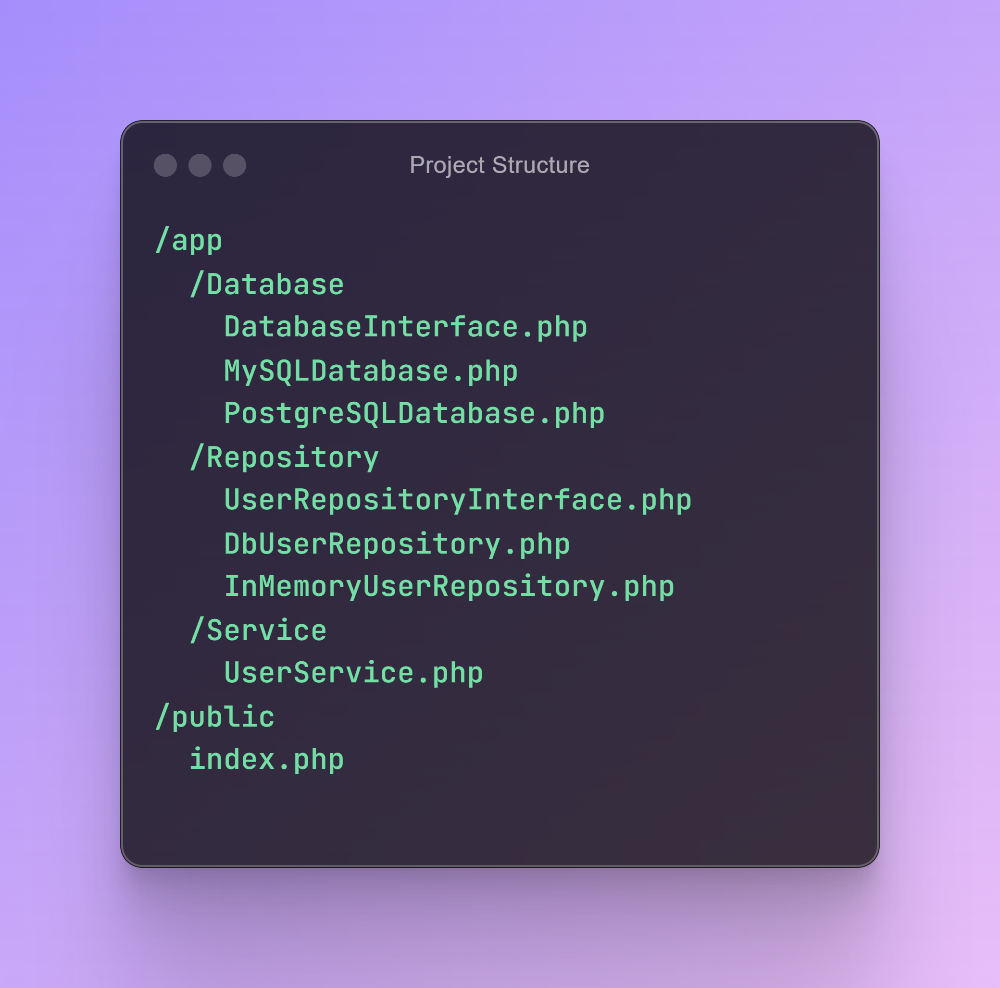

Injeção de Dependência (DI) e Inversão de Dependência (DIP) são dois conceitos centrais no desenvolvimento de software que costumam ser confundidos. Embora estejam relacionados, eles focam em coisas diferentes. A Injeção de Dependência trata de como os objetos recebem suas dependências, tornando os sistemas mais fáceis de testar e mais modulares. A Inversão de Dependência, parte dos princípios SOLID, foca em garantir que o código de alto nível dependa de abstrações, e não de implementações concretas.

Neste artigo, vamos destrinchar como essas ideias trabalham juntas para aumentar a flexibilidade, a manutenibilidade e a escalabilidade do seu código.

## Injeção de Dependência

A capacidade de injetar dependências pelo construtor. Segundo a documentação do Laravel sobre o service container:

> "Injeção de dependência é uma expressão sofisticada que, no fundo, significa o seguinte: as dependências de uma classe são 'injetadas' nela pelo construtor ou, em alguns casos, por métodos 'setter'."

Por exemplo, imagine que você tem um `UserService` e quer se conectar ao banco de dados através de uma classe `Database`. Aqui está uma classe **sem** usar DI:

```php
<?php

class UserService
{
    private MySQLDatabase $database;

    public function __construct() {
        // Atenção: criando uma nova instância dentro da classe !!!
        $this->database = new MySQLDatabase();
    }

    public function getUser($id): string {
        return $this->database->query("SELECT * FROM users WHERE id = $id");
    }
}

class MySQLDatabase
{
    public function query($sql): string {
        return "User data for ID: $sql";
    }
}

$userService = new UserService();
echo $userService->getUser(1);
```

Isso define uma **Associação** na Programação Orientada a Objetos (POO). Mais especificamente, é uma **Associação por Composição**, já que a classe `UserService` mantém uma instância da classe `MySQLDatabase` e controla seu ciclo de vida.

> Composição é uma forma forte de associação. Nela, a classe "container" (ou "todo") **possui** a instância da classe "parte".

Agora vamos reescrever a classe aplicando DI (Injeção de Dependência):

```php
<?php

class UserService
{
    public function __construct(private MySQLDatabase $database) {}

    public function getUser($id): string {
        return $this->database->query("SELECT * FROM users WHERE id = $id");
    }
}

class MySQLDatabase
{
    public function query($sql): string {
        return "User data for ID: $sql";
    }
}

// dependência vinda de fora
$mysqlDatabase = new MySQLDatabase();
// o user service recebe a dependência de fora
$userService = new UserService($mysqlDatabase);

echo $userService->getUser(1);
```

Usar **Injeção de Dependência (DI)** neste exemplo melhora a flexibilidade, a testabilidade e a manutenibilidade, mas, por si só, não desacopla totalmente o sistema. Embora a DI permita que a dependência do banco seja passada de fora em vez de ser instanciada dentro de `UserService`, a classe ainda está presa a uma implementação específica (`MySQLDatabase`). Ou seja, **a DI sozinha não elimina a dependência de implementações concretas**, apenas torna a injeção de dependências mais gerenciável.

## O problema do acoplamento: o DIP resolve

Embora `UserService` agora receba a dependência de fora, ele ainda está fortemente acoplado a `MySQLDatabase`, porque o tipo da dependência é explicitamente definido como `MySQLDatabase`. Se precisássemos trocar para `PostgreSQLDatabase` ou `MongoDBDatabase`, ainda teríamos que modificar `UserService`, o que viola o **Princípio Aberto/Fechado (OCP)**. É aqui que entra o **Princípio da Inversão de Dependência (DIP)**, que promove o uso de **interfaces** em vez de implementações concretas.

Segundo Robert C. Martin (Uncle Bob):

> "Dependa na direção da abstração. Módulos de alto nível não devem depender de detalhes de baixo nível."

No nosso exemplo, ao depender de uma interface (`DatabaseInterface`), `UserService` se torna agnóstico à implementação real do banco. Isso nos permite injetar qualquer classe de banco que implemente `DatabaseInterface`, possibilitando flexibilidade real e reduzindo o acoplamento.

Aqui está a versão refatorada seguindo o **DIP**:

```php
<?php

interface DatabaseInterface
{
    public function query(string $sql): string;
}

class MySQLDatabase implements DatabaseInterface
{
    public function query(string $sql): string
    {
        return "User data from MySQL for ID: $sql";
    }
}

class PostgreSQLDatabase implements DatabaseInterface
{
    public function query(string $sql): string
    {
        return "User data from PostgreSQL for ID: $sql";
    }
}

class UserService
{
    private DatabaseInterface $database;

    public function __construct(DatabaseInterface $database)
    {
        $this->database = $database;
    }

    public function getUser(int $id): string
    {
        return $this->database->query("SELECT * FROM users WHERE id = $id");
    }
}

// Injetando MySQLDatabase
$mysqlDatabase = new MySQLDatabase();
$userServiceMySQL = new UserService($mysqlDatabase);
echo $userServiceMySQL->getUser(1);

// Injetando PostgreSQLDatabase
$postgresDatabase = new PostgreSQLDatabase();
$userServicePostgres = new UserService($postgresDatabase);
echo $userServicePostgres->getUser(2);
```

Agora `UserService` é completamente agnóstico à implementação do banco. Ele não precisa conhecer nenhum detalhe dela, apenas como usá-la através da interface.

O **Princípio da Inversão de Dependência (DIP)** torna o desacoplamento ideal, porque `UserService` não precisa mais saber qual implementação específica de banco ele utiliza. Em vez de depender de uma classe concreta como `MySQLDatabase`, ele depende de uma abstração (`DatabaseInterface`), permitindo que qualquer implementação de banco seja injetada sem modificar `UserService`.

Isso torna mudanças futuras tranquilas. Se for preciso um banco diferente, como `MongoDBDatabase` ou `PostgreSQLDatabase`, basta implementá-lo a partir da interface. Como resultado, o sistema fica mais flexível, mais fácil de manter e alinhado com os **princípios SOLID**, em especial o **Aberto/Fechado (OCP)** e a **Inversão de Dependência (DIP)**.

## Um bom caso de uso: a camada de serviço / padrão Repository

Os exemplos acima são simples. Camadas de serviço, em uma Arquitetura em Camadas, não deveriam acessar implementações de banco diretamente através de classes de banco. Usar um Repository pode ser melhor aqui, pois ele atua como uma abstração sobre as operações de banco, separando a lógica de negócio do acesso a dados.

Isso facilita trocar implementações de banco sem modificar a lógica de serviço, melhorando a manutenibilidade, a escalabilidade e a testabilidade. Aqui está um exemplo usando todos os conceitos explicados até agora e adicionando a camada de repositório.

A estrutura ficaria assim:



> ⚠️ **Nota:** Este é um exemplo bem básico usando PHP puro e PDO. É apenas um exemplo de referência. Em uma aplicação real, você terá mais ferramentas oferecidas por frameworks como Laravel ou Symfony para lidar com injeção de dependência, abstração de banco e outros recursos avançados.

### `/app/Database/DatabaseInterface.php`

```php
<?php

declare(strict_types=1);

namespace App\Database;

interface DatabaseInterface
{
    public function query(string $sql, array $params = []): array;
}
```

### `/app/Database/MySQLDatabase.php`

```php
<?php

declare(strict_types=1);

namespace App\Database;

use PDO;
use PDOException;
use RuntimeException;
use App\Database\DatabaseInterface;

class MySQLDatabase implements DatabaseInterface
{
    private PDO $connection;

    public function __construct()
    {
        try {
            $this->connection = new PDO("mysql:host=localhost;dbname=app", "user", "password");
            $this->connection->setAttribute(PDO::ATTR_ERRMODE, PDO::ERRMODE_EXCEPTION);
        } catch (PDOException $e) {
            throw new RuntimeException(
                "Database connection failed: " . $e->getMessage(),
                (int) $e->getCode(),
                $e
            );
        }
    }

    public function query(string $sql, array $params = []): array
    {
        try {
            $stmt = $this->connection->prepare($sql);
            $stmt->execute($params);
            return $stmt->fetch(PDO::FETCH_ASSOC) ?: [];
        } catch (PDOException $e) {
            throw new RuntimeException(
                "Database query failed: " . $e->getMessage(),
                (int) $e->getCode(),
                $e
            );
        }
    }
}
```

### `/app/Database/PostgreSQLDatabase.php`

```php
<?php

declare(strict_types=1);

namespace App\Database;

use PDO;
use PDOException;
use RuntimeException;
use App\Database\DatabaseInterface;

class PostgreSQLDatabase implements DatabaseInterface
{
    private PDO $connection;

    public function __construct()
    {
        try {
            $this->connection = new PDO("pgsql:host=localhost;dbname=app", "user", "password");
            $this->connection->setAttribute(PDO::ATTR_ERRMODE, PDO::ERRMODE_EXCEPTION);
        } catch (PDOException $e) {
            throw new RuntimeException(
                "Database connection failed: " . $e->getMessage(),
                (int) $e->getCode(),
                $e
            );
        }
    }

    public function query(string $sql, array $params = []): array
    {
        try {
            $stmt = $this->connection->prepare($sql);
            $stmt->execute($params);
            return $stmt->fetch(PDO::FETCH_ASSOC) ?: [];
        } catch (PDOException $e) {
            throw new RuntimeException(
                "Database query failed: " . $e->getMessage(),
                (int) $e->getCode(),
                $e
            );
        }
    }
}
```

### `/app/Repository/UserRepositoryInterface.php`

```php
<?php

declare(strict_types=1);

namespace App\Repository;

interface UserRepositoryInterface
{
    public function getUserById(int $id): ?array;
}
```

### `/app/Repository/DbUserRepository.php`

```php
<?php

declare(strict_types=1);

namespace App\Repository;

use App\Database\DatabaseInterface;
use App\Repository\UserRepositoryInterface;

class DbUserRepository implements UserRepositoryInterface
{
    public function __construct(private DatabaseInterface $database) {}

    public function getUserById(int $id): ?array
    {
        $sql = "SELECT * FROM users WHERE id = :id";
        return $this->database->query($sql, ['id' => $id]);
    }
}
```

### `/app/Repository/InMemoryUserRepository.php`

```php
<?php

declare(strict_types=1);

namespace App\Repository;

use App\Repository\UserRepositoryInterface;

class InMemoryUserRepository implements UserRepositoryInterface
{
    private array $users = [
        1 => ['id' => 1, 'name' => 'Alice', 'email' => 'alice@example.com'],
        2 => ['id' => 2, 'name' => 'Bob', 'email' => 'bob@example.com']
    ];

    public function getUserById(int $id): ?array
    {
        return $this->users[$id] ?? null;
    }
}
```

### `/app/Service/UserService.php`

```php
<?php

declare(strict_types=1);

namespace App\Service;

use App\Repository\UserRepositoryInterface;

class UserService
{
    public function __construct(private UserRepositoryInterface $userRepository) {}

    public function getUserDetails(int $id): ?array
    {
        $user = $this->userRepository->getUserById($id);
        if (empty($user)) {
            return null;
        }
        $user['email'] = substr($user['email'], 0, 3) . '****@' . explode('@', $user['email'])[1];
        return $user;
    }
}
```

Este `UserService` pode parecer **apenas um proxy**, porque ele simplesmente busca os detalhes do usuário, dando a impressão de ser redundante. No entanto, em cenários reais, **as camadas de serviço fazem muito mais do que apenas operações CRUD**.

Em aplicações complexas, a camada de serviço é responsável por **regras de negócio, validações, agregação de dados de múltiplas fontes, controle de transações, cache e orquestração de diferentes dependências**. O exemplo aqui é intencionalmente simples para demonstrar o fluxo da estrutura, facilitando o entendimento no contexto de um artigo.

Embora neste caso ele apenas recupere um usuário e mascare o e-mail, em sistemas de produção os serviços podem ser responsáveis por verificações de permissão, disparo de eventos, envio de notificações ou aplicação de lógica de domínio antes de retornar os dados. Portanto, mesmo que pareça desnecessário agora, as camadas de serviço se tornam cruciais à medida que a complexidade do negócio cresce.

### `/public/index.php`

```php
<?php

declare(strict_types=1);

require __DIR__ . '/../vendor/autoload.php';

use App\Database\MySQLDatabase;
use App\Database\PostgreSQLDatabase;
use App\Repository\DbUserRepository;
use App\Repository\InMemoryUserRepository;
use App\Service\UserService;

$mysqlDatabase = new MySQLDatabase();
$userRepository = new DbUserRepository($mysqlDatabase);
$userService = new UserService($userRepository);
print_r($userService->getUserDetails(1));

$postgresDatabase = new PostgreSQLDatabase();
$userRepositoryPostgres = new DbUserRepository($postgresDatabase);
$userServicePostgres = new UserService($userRepositoryPostgres);
print_r($userServicePostgres->getUserDetails(2));

$inMemoryRepo = new InMemoryUserRepository();
$userServiceMemory = new UserService($inMemoryRepo);
print_r($userServiceMemory->getUserDetails(1));
```

Em frameworks tradicionais como Laravel, Symfony ou Slim, normalmente não instanciamos dependências manualmente como neste exemplo. Em vez disso, usamos o **container de Injeção de Dependência (DI)** para resolver os objetos automaticamente.

## Considerações finais

A ideia é simples: reduzir a dependência entre os componentes. A DI cuida de como as dependências são fornecidas, enquanto o DIP garante que o código dependa de abstrações, e não de implementações. Juntos, eles mantêm tudo modular e adaptável.

Eles também se conectam aos valores ágeis, como adaptabilidade e desenvolvimento incremental, ajudando os times a construir sistemas que evoluem com facilidade conforme as necessidades mudam.

Em resumo, DI e DIP andam de mãos dadas, formando a base para designs de software robustos, escaláveis e modernos.

## Referências

- **Princípios SOLID** — <https://blog.cleancoder.com/uncle-bob/2020/10/18/Solid-Relevance.html>
- **Container de Injeção de Dependência do Laravel** — <https://laravel.com/docs/container>
- **Componente de Injeção de Dependência do Symfony** — <https://symfony.com/doc/current/components/dependency_injection.html>
- **Injeção de Dependência no Slim Framework** — <https://www.slimframework.com/docs/v4/concepts/di.html>
```
